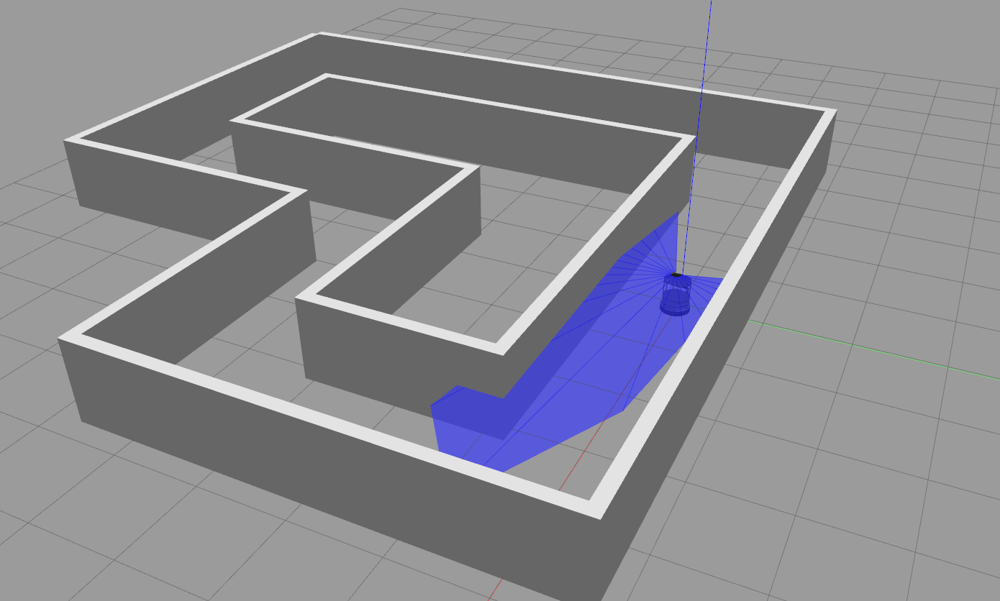

 [](https://travis-ci.org/erlerobot/gym-gazebo)

# An OpenAI gym extension for using Gazebo known as `gym-gazebo`

<!--[](https://travis-ci.org/erlerobot/gym)-->

This repository is a fork of the gym-gazebo repository : https://github.com/erlerobot/gym-gazebo.

This work presents an extension of the initial OpenAI gym for robotics using ROS and Gazebo. A whitepaper about this work is available at https://arxiv.org/abs/1608.05742. Please use the following BibTex entry to cite our work:

```
@article{zamora2016extending,
  title={Extending the OpenAI Gym for robotics: a toolkit for reinforcement learning using ROS and Gazebo},
  author={Zamora, Iker and Lopez, Nestor Gonzalez and Vilches, Victor Mayoral and Cordero, Alejandro Hernandez},
  journal={arXiv preprint arXiv:1608.05742},
  year={2016}
}
```

-----

**`gym-gazebo` is a complex piece of software for roboticists that puts together simulation tools, robot middlewares (ROS, ROS 2), machine learning and reinforcement learning techniques. All together to create an environment whereto benchmark and develop behaviors with robots. Setting up `gym-gazebo` appropriately requires relevant familiarity with these tools.**

**Code is available "as it is" and currently it's not supported by any specific organization. Community support is available [here](https://github.com/erlerobot/gym-gazebo/issues). Pull requests and contributions are welcomed.**

-----

## Table of Contents
- [Environments](#community-maintained-environments)
- [Installation](#installation)
- [Usage](#usage)


## Community-maintained environments
In this course, we will look at some of the gazebo environments for turtlebot maintained by the community using `gym-gazebo`.

| Name | Middleware | Description | Observation Space | Action Space | Reward range |
| ---- | ------ | ----------- | ----- | --------- | -------- |
| `GazeboCircuit2TurtlebotLidar-v0` | ROS | A simple circuit with straight tracks and 90 degree turns. Highly discretized LIDAR readings are used to train the Turtlebot. | | | |
| `GazeboCircuitTurtlebotLidar-v0.png` | ROS | A more complex maze  with high contrast colors between the floor and the walls. Lidar is used as an input to train the robot for its navigation in the environment. | | | TBD |

They have shown to be able to learn using machine learning :

https://www.youtube.com/watch?v=WADmP0wzLxs or http://emanual.robotis.com/docs/en/platform/turtlebot3/machine_learning/#installation

## Installation
Refer to [INSTALL.md](INSTALL.md)

## Usage

### Build and install gym-gazebo

In the root directory of the repository:

```bash
sudo pip install -e .
```

### Running an environment
Run any of the examples available in `examples/`. E.g.:

```bash
cd examples/turtlebot
python circuit2_turtlebot_lidar_qlearn.py
```

This program will display a graph showing the current reward history.


### Display the simulation

To see what the robot is sensing with rviz. First write down the ROS_MASTER_URI used by the previous program, for instance if the terminal displays lines
```Roscore launched!
Unable to register with master node [http://localhost:14508]: master may not be running yet. Will keep trying.
ROS_MASTER_URI=http://server-robot:14508/
```
In a new terminal use commands to visualise with rviz: 
```export ROS_MASTER_URI=http://server-robot:14508
rosrun rviz rviz
```

Display :
- the RGB image to see what the camera sees.
- RobotModel
- LaserScan>Topic : scan
- Fixed Frame : odom
- Grid> Reference Frame: base_link
- map>Topic :  /map

To see what's going on in Gazebo during a simulation, likewise write down the GAZEBO_MASTER_URI used by the python program. In the beginning it will display lines like:
```ROS_MASTER_URI=http://localhost:12461

GAZEBO_MASTER_URI=http://localhost:12462


```

Then simply run gazebo client with the following commands from the terminal:

```export GAZEBO_MASTER_URI=http://localhost:12462
gzclient
```

### Killing background processes

Sometimes, after ending or killing the simulation `gzserver` and `rosmaster` stay on the background, make sure you end them before starting new tests.

We recommend creating an alias to kill those processes.

```bash
echo "alias killgazebogym='killall -9 rosout roslaunch rosmaster gzserver nodelet robot_state_publisher gzclient'" >> ~/.bashrc
```
