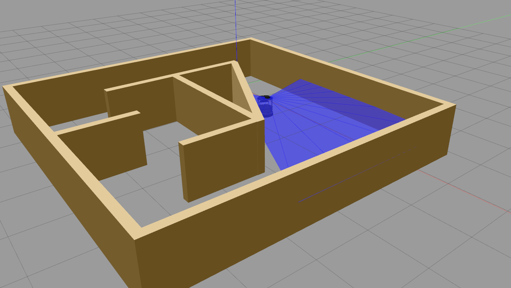

 [](https://travis-ci.org/erlerobot/gym-gazebo)

# An OpenAI gym extension for using Gazebo known as `gym-gazebo`

<!--[](https://travis-ci.org/erlerobot/gym)-->

This repository is a fork of the gym-gazebo repository : https://github.com/erlerobot/gym-gazebo.

The readme of this TP is available on https://github.com/nguyensmai/tp-rl

## Table of Contents
- [Environments](#community-maintained-environments)
- [Installation](#installation)
- [Usage](#usage)


## Community-maintained environments
In this course, we will look at some of the gazebo environments for turtlebot maintained by the community using `gym-gazebo`.

| Name | Middleware | Description | Observation Space | Action Space | Reward range |
| ---- | ------ | ----------- | ----- | --------- | -------- |
| `GazeboCircuit2TurtlebotLidar-v0` | ROS | A simple circuit with straight tracks and 90 degree turns. Highly discretized LIDAR readings are used to train the Turtlebot. | | | |
| `GazeboCircuitTurtlebotLidar-v0.png` | ROS | A more complex maze  with high contrast colors between the floor and the walls. Lidar is used as an input to train the robot for its navigation in the environment. | | | TBD |

They have shown to be able to learn using machine learning :

https://www.youtube.com/watch?v=WADmP0wzLxs or http://emanual.robotis.com/docs/en/platform/turtlebot3/machine_learning/#installation

# First exercise : an atari grid maze
Download the files from the zip or from https://github.com/nguyensmai/tp-rl

In folder examples/maze are files to simulate the maze seen in the lesson. Read the readme.txt. You can run the a sarsa algorithm from the terminal:

```bash
python maze_sarsa.py
```

Sarsa algorithm is not yet implemented. 

**__Q1. Please complete sarsa.py and gridworld.py to find the optimal policy. Report the optimal policy and the rewawrd values observed__**


#Second exercise : a turtlebot in a circuit

## Installation
Refer to [INSTALL.md](INSTALL.md)

## Usage


### Running an environment
Run any of the examples available in `examples/`. E.g.:

```bash
cd examples/turtlebot
python circuit2_turtlebot_lidar_qlearn.py
```

This program will display a graph showing the current reward history.


### Display the simulation

To see what the robot is sensing with rviz. First write down the ROS_MASTER_URI used by the previous program, for instance if the terminal displays lines
```bash
Roscore launched!
Unable to register with master node [http://localhost:14508]: master may not be running yet. Will keep trying.
ROS_MASTER_URI=http://server-robot:14508/
```

In a new terminal use these commands to visualise with rviz: 
```bash
export ROS_MASTER_URI=http://server-robot:14508
rosrun rviz rviz
```

Display :
- the RGB image to see what the camera sees.
- RobotModel
- LaserScan>Topic : scan
- Fixed Frame : odom
- Grid> Reference Frame: base_link
- map>Topic :  /map

To see what's going on in Gazebo during a simulation, likewise write down the GAZEBO_MASTER_URI used by the python program. In the beginning it will display lines like:
```bash
ROS_MASTER_URI=http://localhost:12461
GAZEBO_MASTER_URI=http://localhost:12462
```

Then simply run gazebo client with the following commands from the terminal:

```bash
export GAZEBO_MASTER_URI=http://localhost:12462
gzclient
```

### Killing background processes

Sometimes, after ending or killing the simulation `gzserver` and `rosmaster` stay on the background, make sure you end them before starting new tests.

We recommend creating an alias to kill those processes.

```bash
echo "alias killgazebogym='killall -9 rosout roslaunch rosmaster gzserver nodelet robot_state_publisher gzclient'" >> ~/.bashrc
```

## Details for the environment GazeboCircuit2TurtlebotLIDAR-v0 : 

 This  environment
consists of a simple straight lined circuit with five right turns
and one left turn.  We will use just a LIDAR sensor to train
the  Turtlebot,  no  positioning  or  other  kind  of  data  will  be
used.

  The actions and rewards used in the
environment are the following

- Actions
  -Forward:  v = 0.3 m/s
  -Left/Right:  v = 0.05 m/s , w = +-0.3 rad/s

- Rewards
   - Forward:  5
   - Left/Right:  1
   - Crash:  -200

Forward actions take five times more reward than turns, this
will  make  the  robot  take  more  forward  actions  as  they  give
more  reward.   We  want  to  take  as  many  forward  actions  as
possible  so  that  the  robot  goes  forward  in  straight  tracks,
which will lead to a faster and more realistic behaviour.

Left and right actions are rewarded with 1, as they are needed
to avoid crashes too.  Setting them higher would result in a
zigzagging behaviour.
Crashes  earn  very  negative  rewards  for  obvious  reasons,  we
want to avoid obstacles

## Exploit a learned model
In folder examples/turtlebot you will find data of trained models in *learnResults.npy files.
Use examples/turtlebot/circuit2_turtlebot_lidar_qexploit.py and examples/turtlebot/circuit2_turtlebot_lidar_sarsaExploit.py to test if the robot can navigate in the maze.


**__ Q2. Implement sarsa.py or qlearn.py to allow the robot to use the learned Q-value function. Report the reward graph __**
**__ Q3. (optional) Implement the environment class to see the result on your turtlebot __**
You can look at https://github.com/openai/gym/tree/master/gym/envs to understand the methods you need to implement for your environment class.

## Sarsa

**__ Q4. Implement sarsa algorithm for the simulation turtlebot. Report the learning reward graph __**

## Q-learning

**__ Q4. Implement q-learning algorithm for the simulation turtlebot and the maze. Report the reward graph __**

# Gym-Gazebo
Gym-gazebo work presents an extension of the initial OpenAI gym for robotics using ROS and Gazebo. A whitepaper about this work is available at https://arxiv.org/abs/1608.05742. Please use the following BibTex entry to cite our work:

```
@article{zamora2016extending,
  title={Extending the OpenAI Gym for robotics: a toolkit for reinforcement learning using ROS and Gazebo},
  author={Zamora, Iker and Lopez, Nestor Gonzalez and Vilches, Victor Mayoral and Cordero, Alejandro Hernandez},
  journal={arXiv preprint arXiv:1608.05742},
  year={2016}
}
```

-----

**`gym-gazebo` is a complex piece of software for roboticists that puts together simulation tools, robot middlewares (ROS, ROS 2), machine learning and reinforcement learning techniques. All together to create an environment whereto benchmark and develop behaviors with robots. Setting up `gym-gazebo` appropriately requires relevant familiarity with these tools.**

**Code is available "as it is" and currently it's not supported by any specific organization. Community support is available [here](https://github.com/erlerobot/gym-gazebo/issues). Pull requests and contributions are welcomed.**

-----
-----
